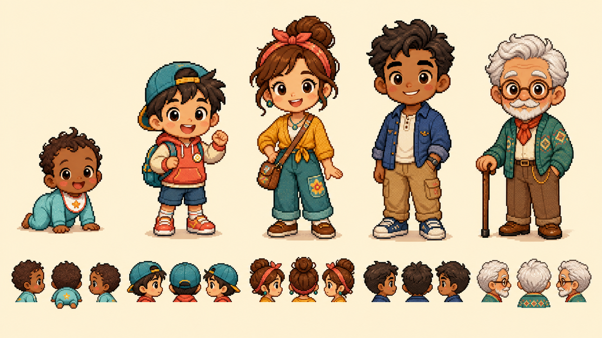

# V5 character style guide

## Goal

Make the people feel warm, playful and immediately readable at gameplay size.
The target is an original cozy chibi language, not a replica of another game's
sprites.

The target sheet was generated specifically for this project as a design
reference. The first v5 release mistakenly stopped there and left deterministic
Canvas drawings in the runtime, which created a visible promise-versus-game gap.
The corrected renderer uses original generated raster turnarounds as its primary
art and keeps the Canvas drawings only as a loading/error fallback.

## Runtime asset system

- Eight independent base atlases and eight matching stage-expansion atlases:
  four heritage styles × two separate genders in each family.
- Male and female identities never share or swap atlas rows.
- Each base atlas follows one coherent identity through baby, child, teen,
  adult, and elder rows. Its matching expansion adds early teen, young adult,
  and middle-age rows without replacing stable base art.
- Every age row contains a real front, left-side, back and right-side frame.
- The complete system contains 256 reviewed directional frames: 160 base and 96
  expansion frames.
- Generated cells are trimmed and repacked to a fixed 256 px grid so heads,
  shoes and accessories cannot be clipped by assumed source-grid boundaries.
- Static directional frames stay active while moving; a restrained bob and lean
  provide motion without switching back to a different art style.
- The generated sheets do not contain seated turnarounds. Seated interactions
  therefore use the existing purpose-built Canvas pose instead of distorting a
  standing raster frame.
- Game height remains driven by the existing twelve-stage profiles. A reviewed
  per-frame foot manifest keeps bodies stable over the shadow while turning,
  even when a bag or cane makes the image bounds asymmetric.

## Shape language

- Large rounded head; soft cheeks; small chin.
- Compact torso with rounded shoulders.
- Short tapered arms and legs with no explicit anatomical joint discs.
- Oversized but simple shoes and mitten-like hands.
- Short or hidden neck.
- Slight asymmetry in every idle pose so figures feel alive.

## Face language

- Large, friendly eyes with one dark outline, colored iris and two highlights.
- Small nose mark rather than a modeled bridge or nostril.
- Visible curved smile; an open smile may show a tiny warm tongue shape.
- Soft cheek blush and expressive brows.
- Elder cues come from hair, glasses, smile lines and posture rather than harsh
  facial anatomy.

## Rendering

- Warm dark-brown outline instead of near-black.
- Flat base color plus one shadow and one highlight; avoid plastic gradients.
- Preserve clean transparent edges and high-quality downsampling at gameplay
  size.
- Preserve a limited palette inside each character.
- Evaluate at actual game size before using zoomed views.

## Motion

- Small body bounce and a slight side-view lean.
- Future walk-cycle sheets may add alternating limbs, but must retain the same
  raster identity throughout movement.
- Side views keep a small button nose and rounded forehead/chin line.
- Back views preserve head/body width and hairstyle identity.

## Variation

All stages, genders, heritages and NPC roles share the same appeal rules.
Heritage affects skin palette, iris, hair texture, hair silhouette and clothing
details. It never changes the character's humanity, friendliness or quality.
Male and female presentation is stored in separate atlas families so a life
cannot accidentally switch gender while aging.

Each heritage/gender pair keeps one coherent identity across its base and
expansion art. Middle school, university, and midlife have dedicated visual
rows, so the player no longer jumps directly from child to generic adult art.
NPC role and outfit metadata remains in the game model and procedural fallback,
but same-age NPCs in one pair currently share that raster identity. Dedicated
role variants, seated rows, and multi-frame walk cycles are later art
expansions, not claims of this release.

## Reference boundary

Sidewalk Iced Tea v3 demonstrated useful broad principles—compact proportions,
warm palettes, readable smiles and character-specific poses. V5 independently
implements those principles through original generated characters and its own
age/gender/heritage mapping. No reference-game PNG, sprite, costume, pose, or
source code is shipped.
